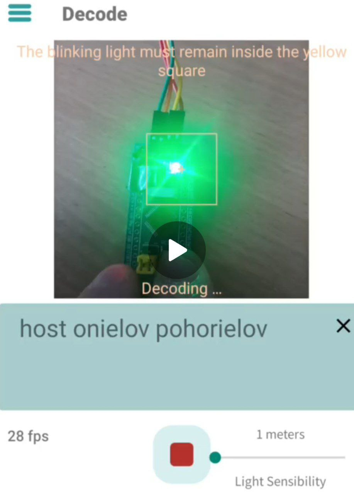
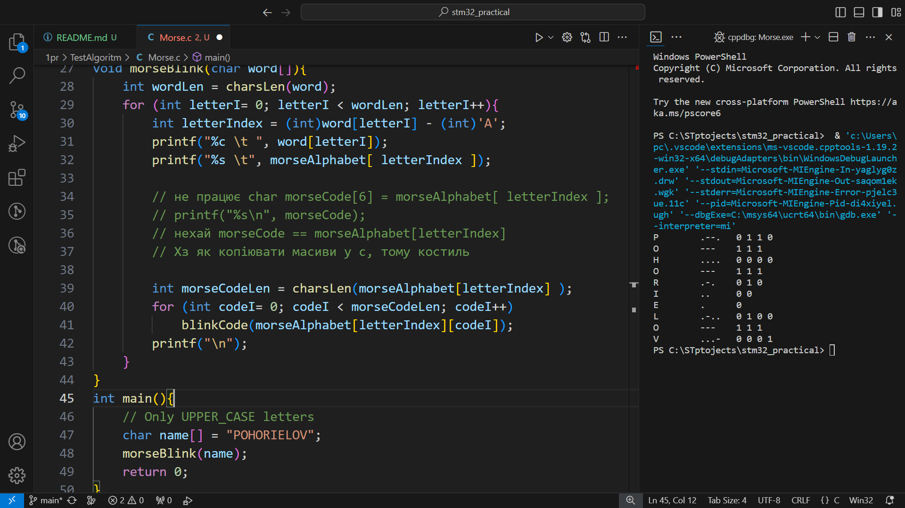

# Morse code BluePill юююююю

[Увесь код для мікроконтроллера](Core/Src/main.c)

## Головні частини коду

### Макроси
``` c
#define DelayDot    100
#define DelayDash   DelayDot * 3
#define DelayChar   DelayDot * 1
#define DelayLetter DelayDot * 2 // + DelayDot
#define DelayWord   DelayDot * 4 // + DelayLetter
```

### USER CODE BEGIN PFP
``` c
void blinkCode(char code);
int charsLen(char str[]);
void morseBlink(char word[]);
```


###  `int Main()` доповнено:
``` c
char name[] = "POHORIELOV";
while (1){morseBlink(name);}
```

###  USER CODE  4
``` c
void blinkCode(char code){
	int codeDelay = DelayDot;
	if (code=='-') codeDelay = DelayDash;
	GPIOC->ODR = 0x0;
	HAL_Delay(codeDelay);
	GPIOC->ODR |= 1 << 13;
	HAL_Delay(DelayChar);
}

char morseAlphabet[26][5] = {
	".-",  "-...",  "-.-.",  // A B C
	"-..", ".",     "..-.",  // D E F
	"--.", "....",  "..",    // G H I
	".---", "-.-",   ".-..",  // J K L
	"--",  "-.",    "---",   // M N O
	".--.", "--.-",  ".-.",   // P Q R
	"...", "-",     "..-",   // S T U
	"...-", ".--",   "-..-",  // V W X
	"-.--", "--.."   		 // Y Z
};

int charsLen(char str[]){
    int i = 0;
    for (; str[i] != '\0'; i++);
    return i;
}

void morseBlink(char word[]){
	int wordLen = charsLen(word);
	for (int letterI= 0; letterI < wordLen; letterI++){
		int letterIndex = (int)word[letterI] - (int)'A'; // (int)'A' == 65
		// char morseCode[6] = morseAlphabet[ letterIndex ];
		// Не працює, а з вказівниками працювати не вмію :(
		int morseCodeLen = charsLen(morseAlphabet[letterIndex] );
		for (int codeI= 0; codeI < morseCodeLen; codeI++)
			blinkCode(morseAlphabet[letterIndex][codeI]);
		HAL_Delay(DelayLetter);
	}
	GPIOC->ODR |= 1 << 13;
	HAL_Delay(DelayWord);
}
```

## Демонстрація роботи

## build+flash
<!-- <video autoplay loop muted controls src="READMEfiles/build+flash.mp4" title="build+flash.mp4"></video> -->

<!-- [](READMEfiles/build+flash.mp4) -->


# decode
<!-- <video autoplay loop muted controls src="READMEfiles/decode.mp4" title="morse decode.mp4"></video> -->

<!-- [](READMEfiles/decode.mp4) -->


---

## Перевірка алоритму на pc
[Код](TestAlgoritm/Morse.c)



---

## TODO:
- [ ] Використати HAL для перемикання пінів
- [ ] Поставити попередн версію кубика, щоб не використовувати костиль з Flash.bat для прошивки китайської STMки
- [ ] Пофіксити попередження:

``` c
../Core/Src/main.c:106:11: warning: implicit declaration of function 'morseBlink' [-Wimplicit-function-declaration]
  106 |           morseBlink(name);
      |           ^~~~~~~~~~
../Core/Src/main.c: At top level:

../Core/Src/main.c:213:6: warning: conflicting types for 'morseBlink'; have 'void(char *)'
  213 | void morseBlink(char word[]){
      |      ^~~~~~~~~~

../Core/Src/main.c:106:11: note: previous implicit declaration of 'morseBlink' with type 'void(char *)'
  106 |           morseBlink(name);
      |           ^~~~~~~~~~
```