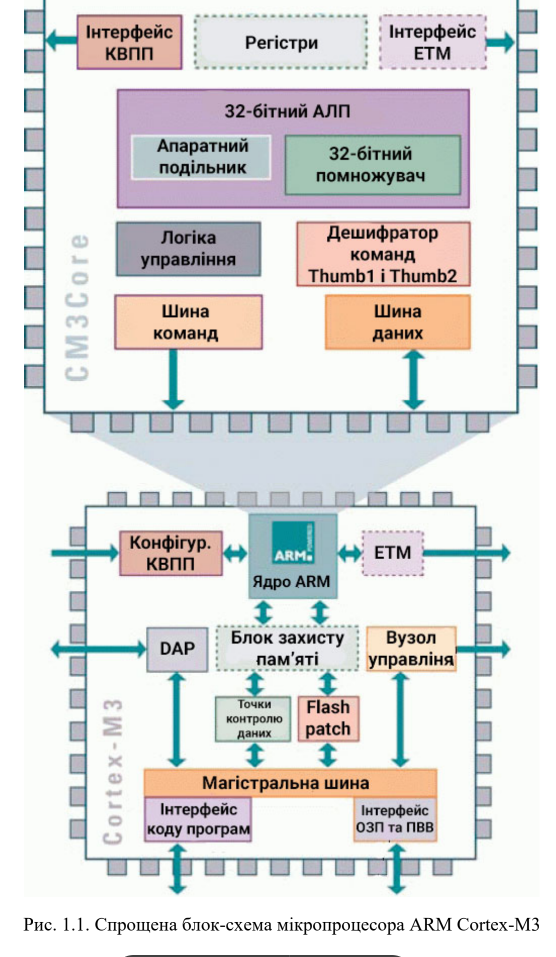
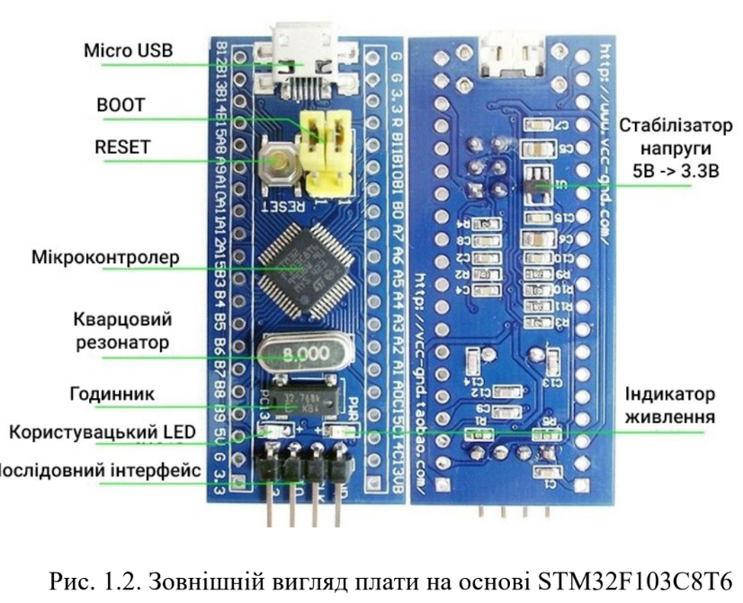
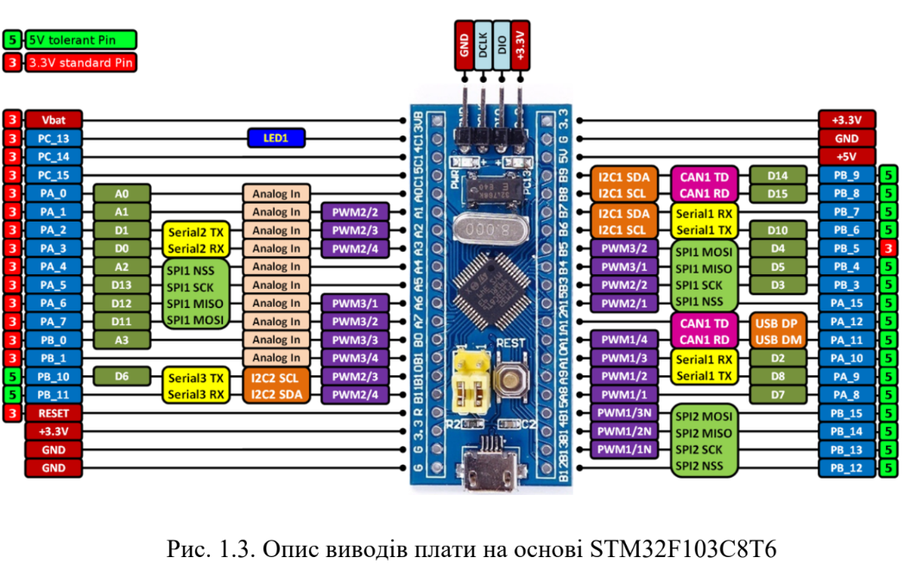

# Контрольні запитання

1. **Особливості мікропроцесора ARM Cortex-M3:**
   - 32-бітна архітектура;
   - RISC (Reduced Instruction Set Computing);
   - Низьке споживання енергії;
   - Апаратна підтримка переривань;
   - Вбудовані засоби управління енергоспоживанням
   


2. **Елементи та основні характеристики плати «STM32 Blue Pill»:**
   - Мікроконтролер STM32F103C8T6 (ARM Cortex-M3);
   - Кварцовий резонатор;
   - USB порт, GPIO виводи, індикатори світлодіодів;
   - Кнопки для введення;
   - Роз'єм для програмування і відладки (зазвичай SWD);
   - Інші необхідні компоненти для живлення та роботи.




3. **Послідовність дій для створення проекту в STM32CubeIDE та завантаження програми до мікроконтролеру:**
   - Створення нового проекту в STM32CubeIDE;
   - Вибір мікроконтролера та конфігурація підсистем;
   - Додавання необхідних бібліотек та налаштування підсистем;
   - Налаштування підключення до мікроконтролера (вибір апаратного інтерфейсу);
   - Написання програмного коду;
   - Компіляція проекту;
   - Завантаження програми на мікроконтролер.

4. **Порт мікропроцесора та структура портів GPIO:**
   
   - Порт - це група виводів мікропроцесора, які можуть взаємодіяти як єдиний функціональний блок.
   - GPIO (General Purpose Input/Output) - це конкретна реалізація порту, яка дозволяє використовувати виводи як вхідні або вихідні.

5. **Режими роботи виводів портів GPIO:**
   
   - Вхід (Input);
   - Вихід (Output);
   - Альтернативна функція (Alternate Function);
   - Аналоговий вхід (Analog Input);
   - Вхід з підтягуючим резистором (Input with Pull-up/Pull-down).
   - Input floating - вхід без підтягуючого резистора (вхід нікуди не
     підключений, «висить» в повітрі);
   - Analog - аналоговий вхід (вхід АЦП, компараторів тощо).
   - Output open-drain - вихід з відкритим стоком. Функціонально
     аналогічний виходу з відкритим колектором. При низькому логічному
     рівні замикає вивід на землю, при високому - залишає не підключеним.
   - Output push-pull - звичайний активний вихід. При низькому логічному
     рівні напруга на виводі дорівнює 0, при високому - напруга близька до
     напруги живлення мікроконтролера, зазвичай + 3 В.
   - Alternate function push-pull - альтернативна функція виведення в
     звичайному (активному) режимі.
   - Alternate function open-drain - альтернативна функція виведення в
     режимі відкритого стоку.

6. **Налаштування виводу мікроконтролера для роботи в режимі активного виходу:**
   
   - Вибір виводу, який буде налаштований;
   - Встановлення режиму вихідного виводу;
   - Вибір типу активного рівня (зазвичай високий рівень);
   - Налаштування швидкості виводу.

7. **Логіка та пояснення коду програми для миготіння світлодіодом із використанням бібліотеки стандарту CMSIS:**
   Програма може виглядати, наприклад, так:
   
   ```c
   #include <stm32f1xx.h>
   
   int main(void) {
       RCC->APB2ENR |= RCC_APB2ENR_IOPCEN; // Enable GPIOC clock
       GPIOC->CRH |= GPIO_CRH_MODE13;     // Output mode, max speed 50 MHz
   
       while (1) {
           GPIOC->BSRR |= GPIO_BSRR_BS13;  // Set GPIOC Pin 13 (turn on LED)
           for (volatile int i = 0; i < 1000000; ++i); // Delay
           GPIOC->BSRR |= GPIO_BSRR_BR13;  // Reset GPIOC Pin 13 (turn off LED)
           for (volatile int i = 0; i < 1000000; ++i); // Delay
       }
   }
   ```

8. **Логіка та пояснення коду програми для миготіння світлодіодом із використанням бібліотеки HAL:**
   Програма може виглядати, наприклад, так:
   
   ```c
   #include "stm32f1xx_hal.h"
   
   int main(void) {
       HAL_Init();
       SystemClock_Config();
   
       // Initialize the GPIO peripheral
       __HAL_RCC_GPIOC_CLK_ENABLE();
       GPIO_InitTypeDef GPIO_InitStruct = {0};
       GPIO_InitStruct.Pin = GPIO_PIN_13;
       GPIO_InitStruct.Mode = GPIO_MODE_OUTPUT_PP;
       GPIO_InitStruct.Speed = GPIO_SPEED_FREQ_LOW;
       HAL_GPIO_Init(GPIOC, &GPIO_InitStruct);
   
       while (1) {
           HAL_GPIO_TogglePin(GPIOC, GPIO_PIN_13); // Toggle the state of GPIOC Pin 13
           HAL_Delay(1000);  // Delay for 1 second
       }
   }
   ```

9. **Алгоритм роботи функці HAL_GPIO_WritePin():**
   Функція призначена для запису (встановлення або скидання) значення на вказаний пін GPIO. Наприклад:
   
   ```c
   HAL_GPIO_WritePin(GPIOC, GPIO_PIN_13, GPIO_PIN_SET);   // Встановити логічний "1"
   HAL_GPIO_WritePin(GPIOC, GPIO_PIN_13, GPIO_PIN_RESET); // Встановити логічний "0"
   ```

10. **Призначення та способи роботи з регістром ODR портів GPIO:**
    Регістр ODR (Output Data Register) використовується для запису значення виводів порту. Наприклад:
    
    ```c
    GPIOC->ODR |= GPIO_PIN_13;    // Встановлення логічного "1"
    GPIOC->ODR &= ~GPIO_PIN_13;   // Встановлення логічного "0"
    ```

11. **Як встановити низький логічний рівень на виводі порту загального призначення?**
    Можна використовувати один з наступних способів:
    
    - `GPIOC->BSRR |= GPIO_BSRR_BR13;` (Скидання бітів в регістрі BSRR);
    - `GPIOC->ODR &= ~GPIO_PIN_13;` (Запис логічного "0" в регістр ODR);
    - `HAL_GPIO_WritePin(GPIOC, GPIO_PIN_13, GPIO_PIN_RESET);` (Використання функції HAL).

12. **Призначення функції HAL_Delay() та її основний недолік:**
    `HAL_Delay()` використовується для затримки в програмі на певний час. Основний недолік полягає в тому, що затримка є блокуючою (не дозволяє виконання інших операцій) і не завжди точно відповідає заданому часу через вплив зовнішніх факторів.

13. **Код у шістнадцятковій системі числення для встановлення високого рівня на 3 та 15 виводах порту GPIO:**
    
    ```c
    // Встановлення високого рівня на 3 та 15 виводах GPIOC
    GPIOC->ODR |= 1 << 0x3 | 1 << 0xF;
    GPIOC->ODR |= GPIO_PIN_3 | GPIO_PIN_15;
    ```