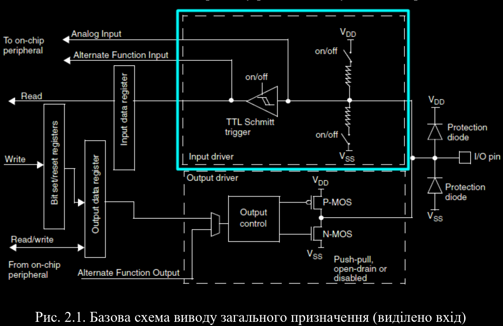
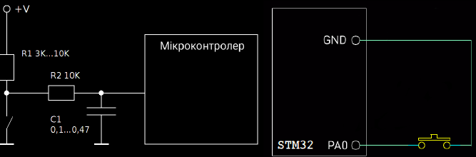

# Контрольні запитання

1. Опишіть структуру та принципи роботи вхідного драйверу виводу порту
GPIO.

2. Поясніть призначення тригера Шмітта.

Тригер Шмітта на
вході – типове рішення для мікроконтролерів. Він визначає вхідні рівні напруг
перемикання, формує на своєму виході стандартні рівні цифрового сигналу (для
КМОН-логіки 0 – 3.3 В) з хорошими фронтами, незалежно від якості вхідного
сигналу. А також захищає від шуму на вході і дозволяє здійснити узгодження
цифрової частини схеми з аналогової без використання додаткових елементів.
Тригер Шмітта активний у всіх вхідних режимах, крім режиму аналогового
входу. У режимі аналогового входу тригер Шмітта відключається і на його
виході формується логічний 0 незалежно від сигналу на вході.

3. Що таке підтягуючі резистори? Наведіть приклади використання.

4. Наведіть схему підключення кнопки до виводів мікроконтролера. Опишіть
два варіанти підключення.

5. Поясніть суть та причини виникнення явища брязкоту механічних контактів.

Апаратне усунення брязкоту – це схемотехнічні рішення, які дозволяють
усунути даний небажаний ефект. Найчастіше це простий RC-ланцюг, або навіть
лише один конденсатор. Принцип роботи такої схеми: конденсатору потрібен
певний час для зарядки (або розрядки). Поки конденсатор повністю не
зарядиться, на вхід мікроконтролера не надійде необхідний сигнал. Цього часу
вистачає на те, щоб перехідний процес встиг завершитися.

6. Опишіть метод апаратного усунення брязкоту. Як розрахувати номінали
елементів, що використовуються в схемі апаратного усунення брязкоту?

7. Поясніть два програмних алгоритми усунення брязкоту. В чому їх переваги
та недоліки?

8. Опишіть послідовність початкових налаштувань мікроконтролера для
підключення кнопки.

9. Опишіть призначення, аргументи та вихідні дані функцій бібліотеки HAL, які
використовуються для управління виводами портів GPIO в режимі входів.

   1. **HAL_GPIO_Init()**:
   - **Призначення**: Ініціалізує конфігурацію GPIO для вказаного порту та піну.
   - **Аргументи**:
     - `GPIO_TypeDef* GPIOx`: Вказує на GPIO порт (наприклад, GPIOA, GPIOB, тощо).
     - `GPIO_InitTypeDef* GPIO_Init`: Вказівник на структуру типу GPIO_InitTypeDef, яка містить параметри ініціалізації, такі як режим роботи, тип виводу, швидкість, і т. д.
   - **Вихідні дані**: Немає конкретних вихідних даних.

   2. **GPIO_InitTypeDef**:
   - **Призначення**: Структура, яка містить параметри ініціалізації для конфігурації GPIO.
   - **Аргументи та вихідні дані**: Структура містить кілька полів, таких як:
     - `Pin`: Бітова маска визначає пін або піни GPIO порту.
     - `Mode`: Режим роботи (входу, виходу, альтернативний вихід і т.д.).
     - `Pull`: Резистор тяги (підтягуючий, відтягуючий або без резистора).

Параметр контексті бібліотеки HAL для мікроконтролерів STM32 параметр `Mode` в структурі `GPIO_InitTypeDef`

1. **GPIO_MODE_INPUT**: Встановлює вивід у режим входу. Такий вивід може приймати сигнали від зовнішніх джерел.

2. **GPIO_MODE_OUTPUT_PP (Push-Pull)**: Встановлює вивід у режим виходу (push-pull). В цьому режимі вивід може генерувати сигнали високого або низького рівня.

3. **GPIO_MODE_OUTPUT_OD (Open-Drain)**: Встановлює вивід у режим виходу з відкритим стоком. В цьому режимі вивід може бути або високим рівнем, або відкритим стоком, але не низьким рівнем.

4. **GPIO_MODE_AF_PP (Alternate Function, Push-Pull)**: Встановлює вивід у режим альтернативної функції (push-pull). Використовується для альтернативних функцій виводів, таких як виводи таймерів або інших спеціальних функцій.

5. **GPIO_MODE_AF_OD (Alternate Function, Open-Drain)**: Встановлює вивід у режим альтернативної функції (open-drain). Схожий на `GPIO_MODE_AF_PP`, але з відкритим стоком.

6. **GPIO_MODE_ANALOG**: Встановлює вивід у режим аналогового входу. Використовується для зчитування аналогових сигналів.

   3. **HAL_GPIO_ReadPin()**:
   - **Призначення**: Зчитує стан вказаного піну порту GPIO.
   - **Аргументи**:
     - `GPIO_TypeDef* GPIOx`: Вказує на GPIO порт.
     - `uint16_t GPIO_Pin`: Вказує на конкретний пін (або піни) на порті.
   - **Вихідні дані**: Стан піну (GPIO_PIN_SET або GPIO_PIN_RESET).

10. Яким чином запрограмувати кнопку для реакції на різний час натискання?
Наведіть блок-схему алгоритму такої програми.