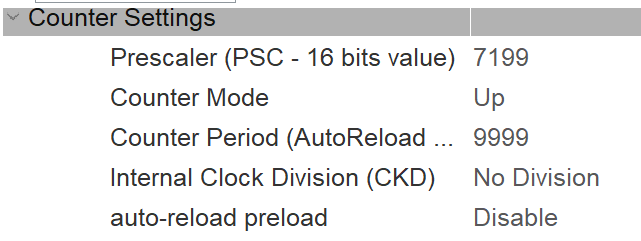

# Лабораторна робота №3
## Тема: ПЕРЕРИВАННЯ. РОБОТА З ТАЙМЕРАМИ
## Мета: 
отримати базові навички організації паралельних процесів з
використанням переривань. Ознайомитись з особливостями конфігурації та
використання таймерів.

## Завдання:

Підключити до плати 3 світлодіоди. Створити лічильник, який 
буде відображати своє значення на світлодіодах у двійковій системі 
числення. Лічильник має рахувати від 0 до 7, збільшуючи своє значення 
кожну секунду. Використовувати функцію HAL_Delay заборонено.

### Хід роботи

1. Налаштування ніжок


2. Налаштовуємо частоту на 72 МГц

3. Для таймеру 2:



> NVIC Settings дозволити переривання за таймером TIM2
>
> Частота переривань = 1 Гц
>
> Подільник частоти (prescaler) * Рахівник (counter) = 72 МГц
>
> Підберемо такі значення, щоб множник частоти був цілим числом, 
або максимально близьким до цілого числа. Один із можливих варіантів: 
Подільник частоти = 7200 і Рахівник = 10000. 
>
> Частота переривань = 72 МГц / (7_200 * 10_000) ≈ 1 Гц


### [Код програми main.c](Core/Src/main.c) 

``` c
/* USER CODE BEGIN PV */
volatile uint8_t countSecond = 0;
/* USER CODE END PV */

/* USER CODE BEGIN PFP */
void displaySecond(void);
/* USER CODE END PFP */

/* USER CODE BEGIN 2 */
HAL_TIM_Base_Start_IT(&htim2);
/* USER CODE END 2 */

/* USER CODE BEGIN 4 */
void displaySecond(void){
  HAL_GPIO_WritePin(GPIOA, LED0_Pin, 
    ((countSecond & 1) >> 0 ? GPIO_PIN_SET: GPIO_PIN_RESET));
  HAL_GPIO_WritePin(GPIOA, LED1_Pin, 
    ((countSecond & 2) >> 1 ? GPIO_PIN_SET: GPIO_PIN_RESET));
  HAL_GPIO_WritePin(GPIOA, LED2_Pin, 
    ((countSecond & 7) >> 2 ? GPIO_PIN_SET: GPIO_PIN_RESET));
  countSecond ++;
  if (countSecond == 8);
  HAL_GPIO_TogglePin (GPIOC, GPIO_PIN_13);
}
/* USER CODE END 4 */
```

### [Код таймеру stm32f1xx_it.c](Core/Src/stm32f1xx_it.c)

``` c
/* USER CODE BEGIN TIM2_IRQn 1 */
displaySecond();
/* USER CODE END TIM2_IRQn 1 */
```

## Демонстрація роботи

