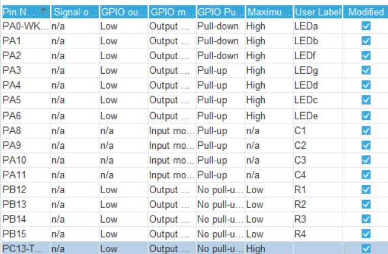
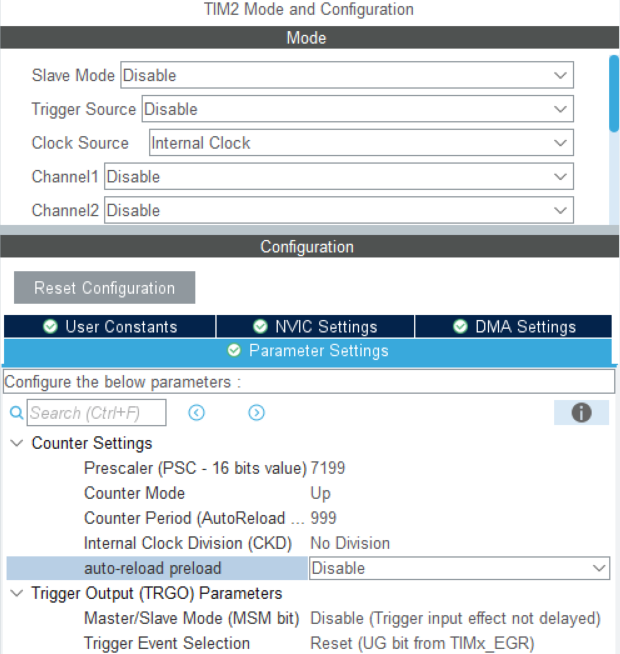
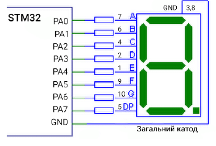

# Лабораторна робота №4
## Тема: СТАТИЧНА ІНДИКАЦІЯ. ПІДКЛЮЧЕННЯ МАТРИЧНОЇ КЛАВІАТУРИ
## Мета: 
Ознайомитись зі схемою підключення семисегментного індикатора
до мікроконтролера. Отримати базові навички роботи з матричною клавіатурою.
Навчитись створювати програмний код для роботи з пристроями введення та
індикації.

## Завдання:
Реалізувати бібліотеку led таким чином, щоб на індикатор
виводились не тільки цифри, а і літери з клавіатури. Водночас, кнопка «*»
повинна засвічувати сегмент крапки (DP), а кнопка «#» – очищувати
семисегментний індикатор (вимикати всі сегменти).

> 7 сегментник був без крапки, тому реалізовано через костиль








## [main.c](Core/Src/main.c)

``` c
/* USER CODE BEGIN PV */
volatile uint8_t key = 0;
/* USER CODE END PV */

/* USER CODE BEGIN PFP */
void keyPadTick(void);
/* USER CODE END PFP */

/* USER CODE BEGIN 2 */
  HAL_TIM_Base_Start_IT(&htim2);
/* USER CODE END 2 */

/* USER CODE BEGIN 4 */
void keyPadTick(void){
    key = read_keypad();
    HAL_GPIO_WritePin(GPIOC, GPIO_PIN_13, 
      ((key!=0)?GPIO_PIN_SET:GPIO_PIN_RESET)
    );
    displayChar(key);
}
/* USER CODE END 4 */
```

## [stm32f1xx_it.c](Core/Src/stm32f1xx_it.c)

```c
/* USER CODE BEGIN TIM2_IRQn 1 */
  keyPadTick();
/* USER CODE END TIM2_IRQn 1 */
```

## [led7display.h](Core/Src/led7display.h)

``` c
const uint8_t codes[18][7] = {
    {1, 1, 1, 1, 1, 1, 0}, // 0
    {0, 1, 1, 0, 0, 0, 0}, // 1
    {1, 1, 0, 1, 1, 0, 1}, // 2
    {1, 1, 1, 1, 0, 0, 1}, // 3
    {0, 1, 1, 0, 0, 1, 1}, // 4
    {1, 0, 1, 1, 0, 1, 1}, // 5
    {1, 0, 1, 1, 1, 1, 1}, // 6
    {1, 1, 1, 0, 0, 0, 0}, // 7
    {1, 1, 1, 1, 1, 1, 1}, // 8
    {1, 1, 1, 1, 0, 1, 1}, // 9
    {1, 1, 1, 0, 1, 1, 1}, // A
    {0, 0, 1, 1, 1, 1, 1}, // B
    {1, 0, 0, 1, 1, 1, 0}, // C
    {0, 1, 1, 1, 1, 0, 1}, // D
    {1, 0, 0, 1, 1, 1, 1}, // E
    {1, 0, 0, 0, 1, 1, 1}, // F
    {0, 0, 0, 0, 0, 0, 1}, // типу point
    {0, 0, 0, 0, 0, 0, 0}  // clear
};
const uint16_t LEDS_PINS[7] = {
    LEDa_Pin, LEDb_Pin, LEDc_Pin, LEDd_Pin, LEDe_Pin, LEDf_Pin, LEDg_Pin
};
GPIO_TypeDef* LEDS_PORTS[7] = {
    LEDa_GPIO_Port, LEDb_GPIO_Port, LEDc_GPIO_Port, LEDd_GPIO_Port,
    LEDe_GPIO_Port, LEDf_GPIO_Port, LEDg_GPIO_Port
};

void displayNumber(uint8_t number){
	for(uint8_t i=0; i<7; i++)
		HAL_GPIO_WritePin( LEDS_PORTS[i], LEDS_PINS[i], codes[number][i] );
}

void displayChar(char charNumber){
	switch (charNumber) {
    case '0' ... '9':
        displayNumber(charNumber - '0');
        break;
    case 'A' ... 'F':
        displayNumber(charNumber - 'A' + 10);
        break;
    case '*':
        displayNumber(16);
        break;
    case '#':
        displayNumber(17);
        break;
    }
}
```

## [keyPad.h](Core/Src/keyPad.h)

``` c
const uint16_t columnPins[4] = { 
    C1_Pin, C2_Pin, C3_Pin, C4_Pin };
const uint16_t rowPins[4] = { 
    R1_Pin, R2_Pin, R3_Pin, R4_Pin };
GPIO_TypeDef* columnPorts[4] = {
    C1_GPIO_Port, C2_GPIO_Port, C3_GPIO_Port, C4_GPIO_Port};
GPIO_TypeDef* rowPorts[4] = {
    R1_GPIO_Port, R2_GPIO_Port, R3_GPIO_Port, R4_GPIO_Port};

const char keypadKeys[4][4]={
    {'1', '2', '3', 'A'},
    {'4', '5', '6', 'B'},
    {'7', '8', '9', 'C'},
    {'*', '0', '#', 'D'}
};

char read_keypad(void) {
    // Deactivate rows
    for (uint8_t row = 1; row < 4 ; row++)
        HAL_GPIO_WritePin(rowPorts[row], rowPins[row], GPIO_PIN_SET);
    for (uint8_t row = 0; row < 4; row++) {
        // Activate row
        HAL_GPIO_WritePin(rowPorts[row], rowPins[row], GPIO_PIN_RESET);
        // Check columns
        for (uint8_t column = 0; column < 4; column++)
            if (! HAL_GPIO_ReadPin(columnPorts[column], columnPins[column]))
                return keypadKeys[row][column];
        // Deactivate row
        HAL_GPIO_WritePin(rowPorts[row], rowPins[row], GPIO_PIN_SET);
    }
    return 0;
}
```