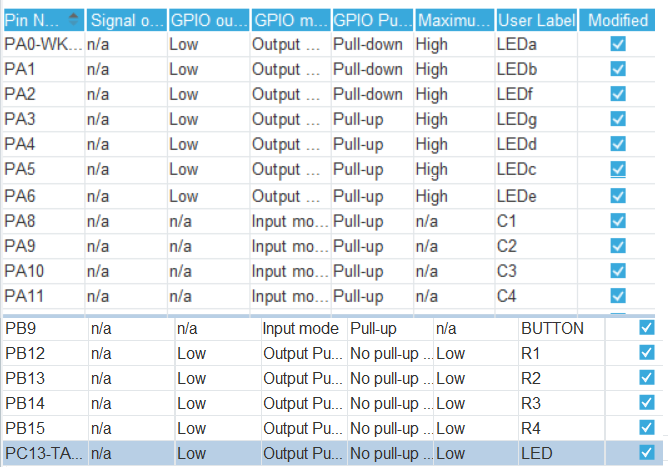

# Лабораторна робота №4
## Тема: СТАТИЧНА ІНДИКАЦІЯ. ПІДКЛЮЧЕННЯ МАТРИЧНОЇ КЛАВІАТУРИ
## Мета: 
Ознайомитись зі схемою підключення семисегментного індикатора
до мікроконтролера. Отримати базові навички роботи з матричною клавіатурою.
Навчитись створювати програмний код для роботи з пристроями введення та
індикації.

## Завдання:
2  Додатково підключити до мікроконтролера кнопку. Написати програму, в якій після натискання на клавіатурі на кнопку "А" на семисегментний індикатор починає кожні 100 мc виводитись випадкове число в діапазоні від 0 до 9. У разі короткого натискання на підключену додаткову кнопку генерація чисел припиняється, за користувацький світлодіод має блимнути стільки разів, скільки показано на індикаторі. Натискання кнопки "В" на клавіатурі має запускати блимання світлодіода повторно. Довге натискання на підключену додаткову кнопку має запускати генерацію заново. Використовувати функцию HAL Delay заборонено.




## [main.c](Core/Src/main.c)

``` c
TODO: скинути сюди
```

## [stm32f1xx_it.c](Core/Src/stm32f1xx_it.c)

```c
/* USER CODE BEGIN TIM2_IRQn 1 */
  tim2tick();
/* USER CODE END TIM2_IRQn 1 */
```

## [led7display.h](Core/Src/led7display.h)

``` c
TODO: скинути сюди
```

## [keyPad.h](Core/Src/keyPad.h)

``` c
TODO: скинути сюди
```

## Демонстрація роботи
[](https://www.youtube.com/watch?v=hnEpnhYboJU)