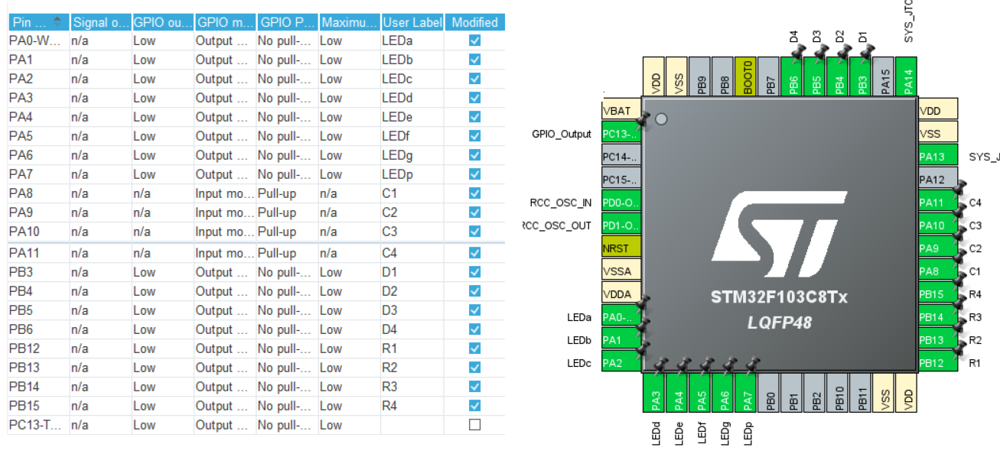
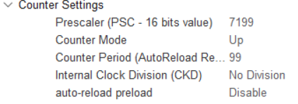

# Практична робота 5

## ТЗ
Реалізувати годинник, який виводить на індикатор поточний час у форматі
ГОД.ХВ. Години та хвилини мають розділятись крапкою, яка блимає з
періодом 1 с. Стартовий поточний час має вводитись з клавіатури.
Використовувати HAL_Delay/GetTick заборонено.

---





---

### [main.c](Core/Src/main.c)

```cpp
/* USER CODE BEGIN Includes */
#include "keypad.h"
#include "led7display4digit.h"
/* USER CODE END Includes */


/* USER CODE BEGIN PD */
// #define DEBUG_DISP // щоб виводити ХВ:СЕК
#define GET_TIME(h_m_s) \ // отримати годину компіляції
  (__TIME__) ? (__TIME__[h_m_s*3] - '0') * 10 + (__TIME__[h_m_s*3+1] - '0') : 0
/* USER CODE END PD */


/* USER CODE BEGIN PFP */
void tim2tick();
/* USER CODE END PFP */


/* USER CODE BEGIN 0 */
volatile int8_t hours   = GET_TIME(0);
volatile int8_t minutes = GET_TIME(1);
volatile int8_t seconds = GET_TIME(2);
volatile uint8_t keyCount = 0;
volatile uint32_t tick_count = 0;
#ifdef DEBUG_DISP
  #define DISP_POS_1 minutes
  #define DISP_POS_2 seconds
#else
  #define DISP_POS_1 hours
  #define DISP_POS_2 minutes
#endif
/* USER CODE END 0 */


/* USER CODE BEGIN 2 */
HAL_TIM_Base_Start_IT(&htim2);
char key_pressed = 0;
/* USER CODE END 2 */


/* USER CODE BEGIN WHILE */
while (1){
  key_pressed = read_keypad();
  if(key_pressed){ // клавіша натиснута?
    if('0' <= key_pressed && key_pressed <= '9'){
      uint8_t digit = key_pressed - '0';
      switch(keyCount){
      case 0:
        DISP_POS_2 = 0;
        DISP_POS_1 = digit * 10 ;
        break;
      case 1:
        DISP_POS_1 = digit + (DISP_POS_1 - DISP_POS_1 % 10);
        break;
      case 2:
        DISP_POS_2 = digit * 10 ;
        break;
      case 3:
        DISP_POS_2 = digit + (DISP_POS_2 - DISP_POS_2 % 10);

        #ifdef DEBUG_DISP
          if(DISP_POS_1>=60) DISP_POS_1 = 0;
        #else
          if(DISP_POS_1>=24) DISP_POS_1 = 0;
          seconds = 0;
        #endif

        if(DISP_POS_2>=60) DISP_POS_2 = 0;

        break;
      }
      if(key_pressed == '*') keyCount = 0;
      if(keyCount++ >=3) keyCount = 0;
      displayNumber(DISP_POS_1 * 100 + DISP_POS_2 + 10000);
  }
}
/* USER CODE END WHILE */


/* USER CODE BEGIN 4 */
// викликається 1000 разів на секунду
void tim2tick(){
  displayTick(); // оноовлення екрана

  if(!keyCount){ // якщо не вводимо нові значення
    if (tick_count == 500) pointBlink();
    if (++tick_count >= 1000) {
      tick_count = 0;
      pointBlink(); // Зміна стану крапки
      if (++seconds >= 60) {
        seconds = 0;
        if (++minutes >= 60) {
          minutes = 0;
          if (hours++ >= 23) hours = 0;
        }
      }
      // Відображення поточного часу
      displayNumber(DISP_POS_1 * 100 + DISP_POS_2 + 10000);
    }
  }
}
/* USER CODE END 4 */
```
### [stm32f1xx_it.c](Core/Src/stm32f1xx_it.c)

```cpp
/* USER CODE BEGIN SysTick_IRQn 1 */
tim2tick();
/* USER CODE END SysTick_IRQn 1 */
```

---

## Демонстрація в режимі ГОД:ХВ


## Демонстрація в режимі ХВ:CЕК (#define DEBUG)

