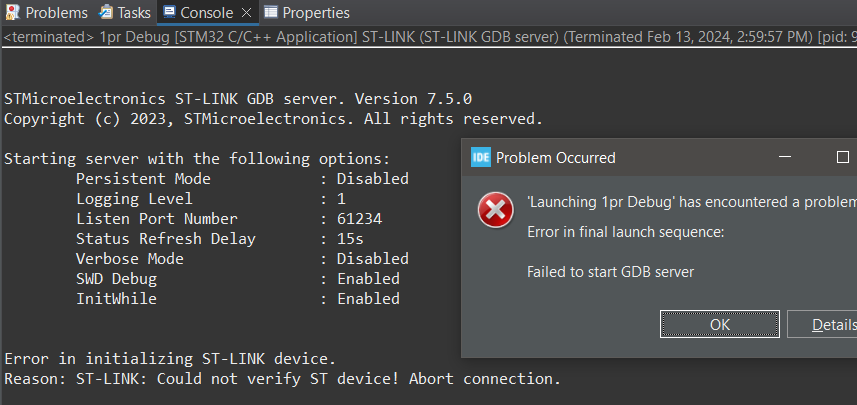

# Китайський клон BluePill не ш'ється
Ні GDB, ні OpenCDB



# Костиль по прошивці через


1. Логінимось та встановлюємо [STM32 ST-LINK utility](https://www.st.com/en/development-tools/stsw-link004.html)


2. У проекті  ствоюмо скрипт `\Build+Flash\Flash.bat`:
```
"C:\Program Files (x86)\STMicroelectronics\STM32 ST-LINK Utility\ST-LINK Utility\ST-LINK_CLI.exe" -P ПОВНИЙ_ШЛЯХ_ДО_ПРОЕКТУ\Build+Flash\1pr.bin 0x08000000 -V -Rst
```

3. Створюємо окремий профіль `Build`


4. Все, тепер можа білдити і прошивати одною кнопкою


---

Це звичайно костиль, дебаг режим відпадає. Але ж працює.
(В інтернеті ходить легенда, що на версії Кубика 1.5 через OpenCDB все працює)